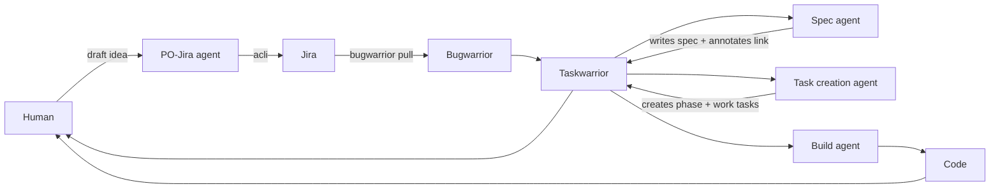
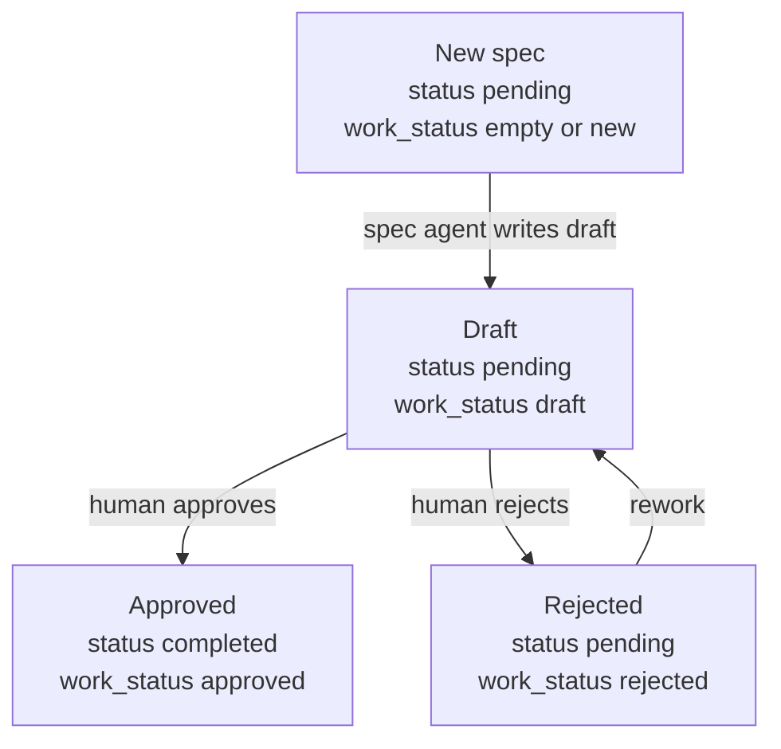
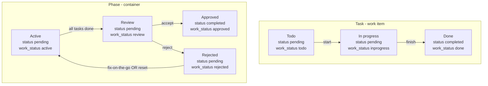

# Agentic Workflow V2

**Opencode × Jira × Bugwarrior × Taskwarrior**

This is a high-level description of the workflow. Detailed technical setup instructions live in `docs/` (for example `docs/setup.md`).

## Goal

Create an **end-to-end, agent-assisted workflow** that:

- Keeps **Jira clean and authoritative**
- Uses **Taskwarrior as the local execution engine**
- Treats **specs as first-class, reviewable artifacts**
- Lets **agents accelerate work** without removing human control
- Works across **multiple repos and developer machines**

This is designed for fintech / regulated environments where correctness, traceability, and human sign-off matter.

---

## Core Principles

1) **Jira = contract**

   - High-level intent
   - Ownership, priority, status
   - Minimal noise

2) **Taskwarrior = execution state**

   - What I am doing, now
   - Specs, subtasks, reviews
   - Local state machines (using `status` + `work_status`)

3) **Bugwarrior = sync layer**

   - Pulls Jira → Taskwarrior
   - Never manages local execution tasks

4) **Agents = accelerators, not decision-makers**

   - Agents may draft, propose, and execute
   - Humans approve specs and code

---

## State model (truth)

I track state using **Taskwarrior `status`** plus a custom **`work_status`** field.

- `status` is coarse: `pending` / `completed`
- `work_status` is fine-grained: `draft`, `review`, `approved`, `rejected`, ...

Recommended vocabulary (lowercase): `new`, `draft`, `todo`, `inprogress`, `review`, `approved`, `rejected`, `done`, `active`.

### Spec tasks

| Meaning | Taskwarrior `status` | `work_status` |
| --- | --- | --- |
| New spec work to do | `pending` | empty or `new` |
| Draft exists | `pending` | `draft` |
| Approved | `completed` | `approved` |
| Rejected / needs rework | `pending` | `rejected` |

### Execution tasks

| Meaning | Taskwarrior `status` | `work_status` |
| --- | --- | --- |
| Ready to start | `pending` | `todo` |
| Being implemented | `pending` | `inprogress` |
| Done | `completed` | `done` |

### Phase tasks

Phase tasks are container tasks tagged `+phase`.

| Meaning                | Taskwarrior `status` | `work_status` |
| ---------------------- | -------------------- | ------------- |
| Phase in progress      | `pending`            | `active`      |
| Phase ready for review | `pending`            | `review`      |
| Phase accepted         | `completed`          | `approved`    |
| Phase rejected         | `pending`            | `rejected`    |

---

## High-level architecture



---

## Workflow breakdown

## 1) Creating stories in Jira

Stories are created agent-first, with human confirmation.

### Tools

- ❌ Atlassian MCP – evaluated, rejected
- ✅ [ACLI](https://developer.atlassian.com/cloud/acli/guides/introduction/) – deterministic, CLI-native

### Agent

**PO-Jira Agent**

Responsibilities:

- Turn rough input into a high-quality Jira story
- Enforce:
  - proper user story format
  - acceptance criteria (Given / When / Then)
  - INVEST quality gate
- Ask for:
  - Jira project (`IN`, `IMP`, `DEVOPS`)
  - optional epic (never guessed)

Constraints:

- Agent never creates tickets without explicit confirmation
- Agent never guesses project or epic
- Jira description uses Jira wiki markup (not Markdown)

---

## 2) Retrieving stories from Jira (Bugwarrior)

Jira is synced locally using Bugwarrior.

Purpose:

- Pull assigned, open Jira issues
- Represent them as local “contract tasks”

Result:

Each Jira issue becomes one Taskwarrior task:

- Description: `KEY Summary`
- Tags: `+jira` + Jira labels
- UDA fields: `jira_assignee`, and optionally status/priority/epic
- Jira description stored as annotation

Important: Bugwarrior tasks are never edited manually.

---

## 3) Spec drafting (Spec agent)

Specs are local design gates, not Jira subtasks.

### How I start a spec (actual workflow)

1. List spec tasks locally:

   ```bash
   task specs
   ```

   This shows the spec tasks and the `jiraid` I want to work on.

2. Start the spec flow:

   ```bash
   /specjira JIRA-XXX
   ```

   `/specjira` does **not** call Jira directly. It pulls the Jira summary + description from the Jira task that Bugwarrior synced into Taskwarrior.
   If the Jira task is missing/outdated, run `bugwarrior-pull` first.

   The spec is written to a portable location under `$LLM_NOTES_ROOT` and linked back to the spec task via an annotation.

### Spec tasks

New specs start as:

> status: pending
> work_status: (empty)

Spec agent writes a first draft and stores it at:

`$LLM_NOTES_ROOT/<repo>/notes/specs/<JIRAKEY>__<slug>.md`

This path is intentionally portable:

- every dev machine can use a different absolute location for `$LLM_NOTES_ROOT`
- the spec task only stores a relative path (via Taskwarrior annotations)

It annotates that location onto the Taskwarrior task.

Then the spec task becomes:

> status: pending
> work_status: draft

#### Mermaid: spec lifecycle



---

## 4) Human spec review

If approved without changes:

> status: completed
> work_status: approved

If the spec needs rework:

> status: pending
> work_status: rejected

Then iterate until happy. Taskwarrior history shows whether it passed on the first try.

---

## 5) Task creation (from spec → execution tasks)

The task creation agent pulls the spec (via the Taskwarrior annotation) and creates hierarchical tasks.

New execution tasks start as:

> status: pending
> work_status: todo

---

## 6) Implementation (phases + tasks)

Implementation is structured in phases.

### Phase tasks

Phase tasks:

- Tag: `+phase`
- Act as container / sequencing points
- Tasks inside the phase are executed sequentially and use Taskwarrior dependencies

While the phase is being worked on:

> status: pending
> work_status: active

### Work tasks

When implementation starts a task:

> status: pending
> work_status: inprogress

When done:

> status: completed
> work_status: done

### Phase ready for review

Once all tasks inside a phase are done, the phase becomes:

> status: pending
> work_status: review

#### Mermaid: task + phase lifecycle



---

## 7) Human phase review (tests + code review)

### Accepted

If accepted:

> status: completed
> work_status: approved

This is set for all tasks inside the phase.

Then run:

- `/test`
- `/git` (commit per phase)

### Rejected

If rejected:

> status: pending
> work_status: rejected

There are two main options:

- Fix it on the go (prompt + patch)
- Redo the specs and start over from scratch
  - delete the tasks and start over from the spec
  - switch the spec to `rejected` before restarting

---

## 8) PR creation

If we accept the phase (and eventually all phases), we create a PR:

`/create-pr`

---

## What this gives you

- Clean Jira
- Local-first execution
- Specs as real artifacts (linked via annotations)
- Explicit design / review gates
- Agent acceleration without loss of control
- Full audit trail (Taskwarrior history)
