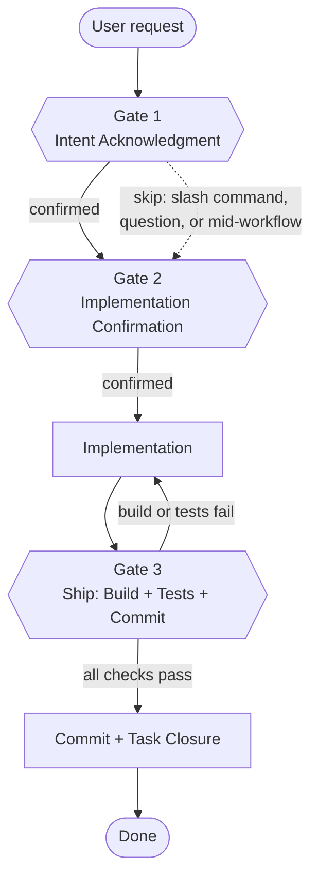
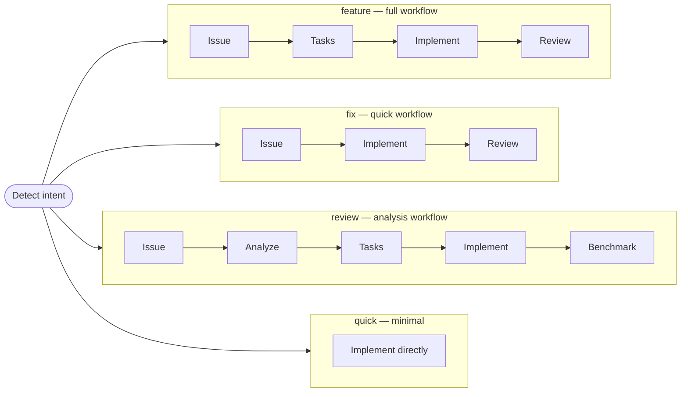
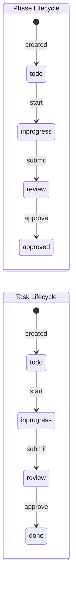
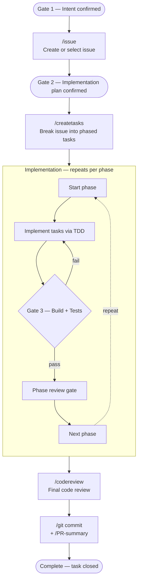

# OpenCode Agentic Workflow Framework

A pluggable, agent-assisted development workflow for OpenCode. Covers the full lifecycle — from brainstorming to merged PR — while keeping humans in control at every approval gate.

---

## What it does

- **`/plan`** — brainstorm features, prioritize a backlog, bulk-create issues (with optional Epic)
- **`/feature`** — full lifecycle orchestrator: issue → tasks → implement → review
- **`/fix`** — same flow, tuned for bug fixes
- **`/resume`** — pick up any in-progress work item across sessions
- **`/status`** — dashboard of all active work items and their stages
- Step-by-step commands: `/issue`, `/createtasks`, `/implement`
- Utility commands: `/git`, `/test`, `/codereview`, `/PR-summary`

Workflow state is tracked in the configured backend so you can close the terminal and resume days later.

---

## Quick start

```bash
# 1. Clone this repo
git clone https://github.com/your-username/opencode.git

# 2. Initialize OpenCode workflow in your project
cd opencode
./bin/opencode-init ~/projects/myapp          # beads backend (default)
./bin/opencode-init --backend=jira-taskwarrior ~/projects/myapp

# 3. Open your project in OpenCode and start working
cd ~/projects/myapp
# /plan "improve onboarding"     ← brainstorm & bulk-create a backlog
# /feature ISSUE-1               ← start the full lifecycle
# /resume  ISSUE-1               ← pick up where you left off
# /status                        ← see all active work
```

---

## Agents and Modes

This workflow system uses OpenCode's **agent** system to provide specialized AI assistants for different tasks.

### How it works with OpenCode's built-in modes

OpenCode has two built-in **primary agents** that you switch between with **Tab**:

| Primary Agent | Purpose | Tool Access |
|---------------|---------|-------------|
| **Build** | Full development work | All tools enabled |
| **Plan** | Analysis and planning | Read-only (no edits) |

Our workflow agents are **subagents** — specialized assistants invoked by slash commands:

| Subagent | Invoked by | Purpose |
|----------|------------|---------|
| `plan-mode` | `/plan` | Brainstorm features, create backlog |
| `create-tasks` | `/createtasks`, `/feature` | Break issue into phased tasks |
| `build` | `/implement`, `/feature` | Implement tasks with TDD |
| `code-reviewer` | `/codereview`, `/feature` | Review code changes |
| `test-agent` | `/test` | Run and fix tests |

### Usage pattern

```
┌─────────────────────────────────────────────────────┐
│  1. Use Tab to switch to Plan mode (read-only)     │
│  2. Run /plan "improve onboarding" → plan-mode     │
│  3. Switch to Build mode with Tab                   │
│  4. Run /feature ISSUE-1 → create-tasks             │
│     → build → code-reviewer                         │
└─────────────────────────────────────────────────────┘
```

Subagents run in **child sessions** and return results to your main conversation.

### Model configuration

Agents inherit the model from your OpenCode configuration. To use different models for different agents, configure them in your `opencode.json`:

```json
{
  "$schema": "https://opencode.ai/config.json",
  "model": "anthropic/claude-sonnet-4-20250514",
  "agent": {
    "plan-mode": {
      "model": "anthropic/claude-sonnet-4-20250514"
    },
    "spec-mode": {
      "model": "anthropic/claude-sonnet-4-20250514"
    },
    "build": {
      "model": "anthropic/claude-sonnet-4-20250514"
    }
  }
}
```

The model ID format is `provider/model-id`. Common providers:
- `anthropic/claude-sonnet-4-20250514`
- `openai/gpt-4o`
- `github-copilot/claude-sonnet-4`
- `opencode/gpt-5.1-codex` (OpenCode Zen)

Run `opencode models` to see available models for your configured providers.

---

## Backends

| Backend | Best for | Dependencies |
|---------|----------|--------------|
| `file` | Solo developers, simple projects, getting started | None |
| `beads` | Individuals wanting lightweight local workflow | Beads (`bd`) CLI |
| `jira-taskwarrior` | Teams using Jira | ACLI, Taskwarrior |

### Beads backend (default)

Lightweight local-first task manager using the `bd` CLI. Issues and tasks stored locally; no external service required.

`.agent/config.json`:
```json
{
  "backend": {
    "type": "beads",
    "config": {
      "workspaceDir": "/path/to/project",
      "beadsDir": "/path/to/project/.beads"
    }
  }
}
```

Run `bd init --stealth` in your project root before first use. See [`backends/beads/README.md`](backends/beads/README.md) for setup.

### Mock backend

Zero dependencies. In-memory backend for testing and demos. Does not persist state between sessions.

`.agent/config.json`:
```json
{
  "backend": { "type": "mock", "config": {} }
}
```

### Jira-Taskwarrior backend

Uses Atlassian CLI (ACLI) for Jira and Taskwarrior for local task execution.

`.agent/config.json`:
```json
{
  "backend": {
    "type": "jira-taskwarrior",
    "config": {
      "jiraSite": "your-org.atlassian.net",
      "jiraProject": "PROJ",
      "jiraEmail": "you@example.com",
      "taskrcPath": "~/.taskrc",
      "taskDataLocation": "~/.task"
    }
  }
}
```

See [`backends/jira-taskwarrior/README.md`](backends/jira-taskwarrior/README.md) for setup.

---

## Typical workflow

### Option A — Full lifecycle (recommended)

```
/feature ISSUE-1
```

Drives you through every stage with pause points:

1. **tasks** — agent breaks the issue into phased implementation tasks; you approve
2. **implement** — agent implements task by task (TDD); phase review gates after each phase
3. **review** — final code review + PR summary

At each gate you choose: `[c]ontinue  [s]kip  [a]uto-run  [q]uit`

#### YOLO mode

```
/feature ISSUE-1 --yolo
/fix     ISSUE-2 --yolo
/resume  ISSUE-1 --yolo
```

Skip **all** approval gates — the AI executes the entire lifecycle end-to-end
without stopping for human review. Tests are still run; failures are fixed
automatically rather than reported. Only unrecoverable errors cause a stop.

The `--yolo` flag is a session flag passed at invocation time and is not persisted
between sessions. Pass it again with `/resume` to continue in YOLO mode.

### Option B — Step by step

```bash
/issue "Add CSV export to reports"   # create issue
/createtasks ISSUE-1                 # generate phased tasks
/implement   ISSUE-1                 # implement phase by phase
/test                                # run tests
/codereview                          # review the diff
/git "feat(reports): add CSV export" # commit
/PR-summary                          # write PR description
```

### Option C — Brainstorm first

```bash
/plan "improve developer onboarding"
# → discovery questions → feature proposals → prioritized backlog
# → bulk-creates issues (auto-creates an Epic when backlog > 1 item)
# → backlog exported to plans/<plan-id>-backlog.md
```

---

## Workflow Diagrams

### Three-Gate System

Every non-trivial task passes through three gates before completion.
Gate 1 may be skipped in specific conditions (shown as dotted lines); **Gate 2 is never skipped**.
Gate 3 auto-loops on build/test failures and verifies PR size (~500 LOC limit) before committing.



### Workflow Types

Intent detection routes your request to the appropriate workflow:



### Task Lifecycle

State machines for the core entities:



### End-to-End Feature Flow

The full `/feature` pipeline with gate checkpoints:



---

## opencode-init

`bin/opencode-init` copies all workflow files into `.agent/` of a target project.

```
Usage: opencode-init [OPTIONS] [target-dir]

Options:
  --backend=TYPE    beads (default), mock, or jira-taskwarrior
  --stack=backend   Copy all backend infra skills (postgres, kafka, docker, …)
  --skills=LIST     Comma-separated skills (e.g. postgres,kafka,docker)
  --lang=LANG       Language tooling: go, rust, node, python, both
  --with-startup    Add flachnetz/startup library (Go)
  --list-skills     List all available skills
```

What gets installed into `.agent/`:

```
.agent/
  command/        all workflow commands
  agent/          create-tasks, plan-mode, build,
                  test-agent, code-reviewer
  backends/       chosen backend implementation
  lib/            backend-loader.js, plan-state.js
  config.json     workflow backend configuration
  skills/         workflow-backend (always), plus any --stack/--skills/--lang extras
plans/            backlog markdowns from /plan (committed to git)
opencode.json     OpenCode configuration ($schema, instructions, providers)
AGENTS.md         AI assistant context (customize for your project)
```

To pull in updates after the initial setup, use `opencode-sync` (see below).

---

## opencode-sync

`bin/opencode-sync` refreshes workflow files in an already-initialized project without touching any project-specific config or state.

```
Usage: opencode-sync [OPTIONS] [target-dir]

Options:
  --dry-run     Show what would be updated without making changes
  --verbose     Show each file being copied
```

What is updated:

```
.agent/commands/     All slash commands (synced from source, stale removed)
.agent/agents/       All agents (synced from source, stale removed)
.agent/lib/          backend-loader.js, plan-state.js
.agent/backends/     Active backend implementation
.agent/skills/       All skill packs (synced from source)
```

What is **never** touched:

```
.agent/config.json   Your backend configuration
.agent/state/        Runtime workflow data (issues, tasks)
AGENTS.md            Your project AI context
opencode.json        Your OpenCode provider/model config
plans/               Your plan documents
```

All agents and skills are synced unconditionally — the AI will self-select which ones are relevant based on your codebase context.

---

## Repository layout

```
agent/              agent definition files
backends/
  file/             zero-dependency local backend
  beads/            Beads local-first backend
  jira-taskwarrior/ Jira + Taskwarrior backend
bin/
  opencode-init     project initializer
  opencode-sync     sync workflow files into an initialized project
  opencode-update   update the opencode-init binary itself
command/            slash command definitions
lib/
  backend-loader.js runtime backend selection
  plan-state.js     plan + epic state persistence
skills/             reusable skill packs (postgres, kafka, coding-standards, …)
templates/
  AGENTS.md.tmpl    AGENTS.md template used by opencode-init
```

---

## Adding a custom backend

Implement the `WorkflowBackend` interface (see `backends/beads/index.js` as a reference):

```typescript
interface WorkflowBackend {
  getIssue(id: string): Promise<Issue>
  getTasks(filter: TaskFilter): Promise<Task[]>
  createTasks(issueId: string): Promise<Task[]>
  updateTaskState(taskId: string, state: string): Promise<Task>
  linkIssueToEpic(issueId: string, epicId: string): Promise<Issue>
  // … see backends/beads/index.js for the full contract
}
```

Place your implementation in `backends/<name>/index.js` and register it in `lib/backend-loader.js`. Then configure it in `.agent/config.json`:

```json
{ "backend": { "type": "<name>", "config": { ... } } }
```

---

## Credits & Acknowledgments

This project is a fork of [opencode by Geert Theys](https://github.com/gtheys/opencode). A huge thanks to Geert for laying the groundwork — the original slash command structure, agent definitions, and workflow orchestration concepts all trace back to that repo.

**What this fork adds on top:**

- Backend-agnostic workflow engine (`beads`, `jira-taskwarrior`, `mock`) with a common backend interface
- Full slash command suite: `/plan`, `/feature`, `/fix`, `/resume`, `/status`, `/issue`, `/createtasks`, `/implement`, `/git`, `/test`, `/codereview`, `/PR-summary`
- Epic auto-creation and issue-to-epic linking across all backends
- `opencode-init` installer with language tooling, startup library detection, and multi-backend support
- `opencode-sync` for keeping workflow files up to date in initialized projects
- Separation of workflow config (`.agent/config.json`) from OpenCode native config (`opencode.json`) to comply with upstream schema validation
- macOS bash 3.2 compatibility throughout all shell scripts

If this project is useful to you, go give Geert's repo a star too.

---

## Development (dogfooding)

This repo uses its own workflows for development — "eating our own dogfood". This ensures the workflows, agents, and skills stay optimized through real-world usage.

### Setup for development

```bash
# 1. Clone the repo
git clone https://github.com/your-username/opencode.git
cd opencode

# 2. Initialize beads (if not already done)
bd init

# 3. Initialize opencode workflow in this repo
bin/opencode-init --backend=beads .

# 4. Sync to get all agents (opencode-init only copies core agents)
bin/opencode-sync .
```

The `.agent/` directory is gitignored — each developer sets up their own local workflow.

### Running tests

```bash
# Run all tests
npm run test:all

# Jest tests only (lib/)
npm test

# Bash tests only (bin/)
npm run test:bash
```

### Making changes

When changing workflow files (agents, commands, skills), the changes are immediately available in this repo since `.agent/` symlinks to the source directories. For other projects, run `opencode-sync` to pull in updates.

---

## License

MIT
