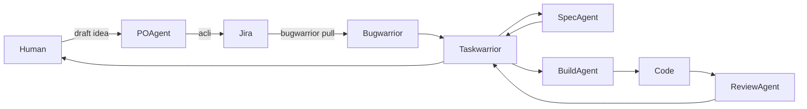
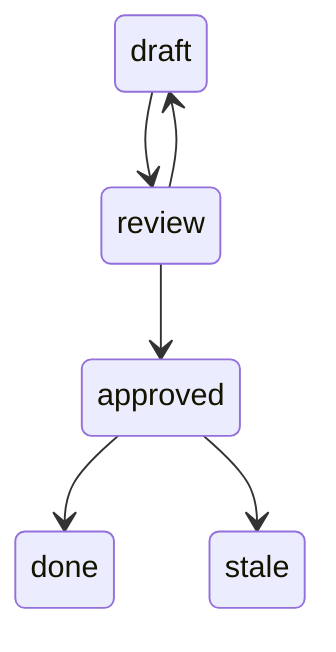
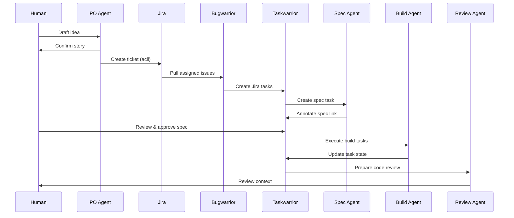

# Agentic Workflow V2

**Opencode × Jira × Bugwarrior × Taskwarrior**

This is highevel description of the workflow. The detailed [technical setup instructions](docs/setup.md) and setup can be found in the docs folder.

## Goal

Create an **end-to-end, agent-assisted workflow** that:

* Keeps **Jira clean and authoritative**
* Uses **Taskwarrior as the local execution engine**
* Treats **specs as first-class, reviewable artifacts**
* Allows **agents to accelerate work** without removing human control
* Works across **multiple repos and developer machines**

This workflow is designed for **fintech / regulated environments** where correctness, traceability, and human sign-off matter.

---

## Core Principles

1. **Jira = Contract**

   * High-level intent
   * Ownership, priority, status
   * Minimal noise

2. **Taskwarrior = Execution State**

   * What *you* are doing, now
   * Specs, subtasks, reviews, local state machines

3. **Bugwarrior = Sync Layer**

   * Pulls Jira → Taskwarrior
   * Never manages local execution tasks

4. **Agents = Accelerators, not decision-makers**

   * Agents may draft, propose, execute
   * Humans approve specs and code

---

## High-Level Architecture



---

## Workflow Breakdown

---

## 1. Creating Stories in Jira

Stories are created **agent-first**, with **human confirmation**.

### Tools

* ❌ Atlassian MCP – evaluated, rejected
* ✅ [ACLI](https://developer.atlassian.com/cloud/acli/guides/introduction/) – deterministic, CLI-native

### Agent

**PO-Jira Agent**

Responsibilities:

* Turn rough input into a **high-quality Jira story**
* Enforce:

  * Proper user story format
  * Acceptance criteria (Given / When / Then)
  * INVEST quality gate
* Ask for:

  * Jira project (`IN`, `IMP`, `DEVOPS`)
  * Optional Epic (never guessed)

Execution:

```
Human → PO-Jira Agent → acli → Jira
```

Constraints:

* Agent **never** creates tickets without explicit confirmation
* Agent **never** guesses project or epic
* Jira description uses **Jira wiki markup**, not Markdown

---

## 2. Retrieving Stories from Jira

Jira is synced locally using **Bugwarrior**.

### Tools

* [Taskwarrior](https://taskwarrior.org/)
* [Bugwarrior](https://github.com/GothenburgBitFactory/bugwarrior)

### Purpose

* Pull **assigned, open Jira issues**
* Represent them as **read-only contract tasks**

### Result

Each Jira issue becomes **one Taskwarrior task**:

* Description: `KEY Summary`
* Tags: `+jira` + Jira labels
* UDA fields:

  * `jira_assignee`
  * (optionally status, priority, epic)
* Jira description stored as **annotation**

⚠️ Bugwarrior tasks are **never edited manually**.

---

## 3. Spec Agent

Specs are **local design gates**, not Jira subtasks.

### Spec Tasks

For each Jira issue, the spec agent creates **one local spec task**:

```bash
SPEC: IN-1423 read migration
```

Characteristics:

* `+spec` tag
* Depends on the Jira task UUID
* Managed **only locally**

### Spec Location (Portable)

Specs live in:

```
$LLM_NOTES_ROOT/
  └── <repo>/notes/spec/
```

Annotations use **portable paths**:

```
Spec(repo=project1): project1/notes/spec/IN-1423__read-migration.md
```

Resolution rule:

```
$LLM_NOTES_ROOT/<relative-path>
```

This works on **every developer machine**.

### Spec State

Specs have an explicit lifecycle via a UDA:

* `draft`
* `review`
* `approved`
* `stale`

Agents may:

* Create specs
* Update to `draft` / `review`

Only humans may:

* Mark specs as `approved`

---

## 4. Human Spec Review

Specs are **reviewed before implementation**.

### Review Flow



You can list specs needing attention:

```bash
task +spec spec_state:review
```

The Taskwarrior task acts as:

* Review checklist
* Index of spec files (via annotations)
* Audit trail

---

## 5. Build Phase

Implementation work is **unblocked only after spec approval**.

### Build Tasks

Implementation tasks:

* Depend on the spec task UUID
* Live in repo-specific project namespaces
* Are safe for agents to execute

Example:

```bash
Implement read path behind feature flag
```

### Build Agent

The build agent:

* Reads the approved spec
* Executes tasks
* Updates local task state
* Never modifies Jira directly

---

## 6. Code Review (Agent)

When implementation tasks complete:

* A **code review agent**:

  * Collects related tasks
  * Gathers diffs / PRs
  * Prepares review context

This reduces review load without removing human responsibility.

---

## 7. Human Code Review

Human review is explicit and trackable.

### State

* Code review tasks have:

  * `+review` tag
  * Optional `review_state` UDA

You can list pending reviews:

```bash
task +review
```

Approval:

* Human approves PR
* Marks review task as done
* Jira transitions happen manually or via a separate controlled step

---

## End-to-End Control Flow



---

## What This Gives You

* ✅ Clean Jira
* ✅ Local-first execution
* ✅ Portable specs
* ✅ Explicit design gates
* ✅ Agent acceleration without loss of control
* ✅ Full audit trail
