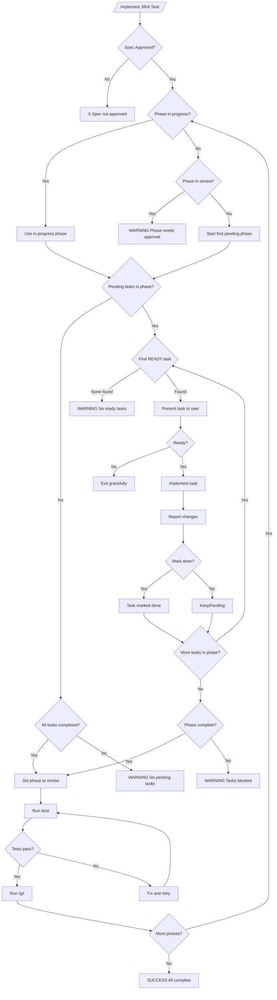
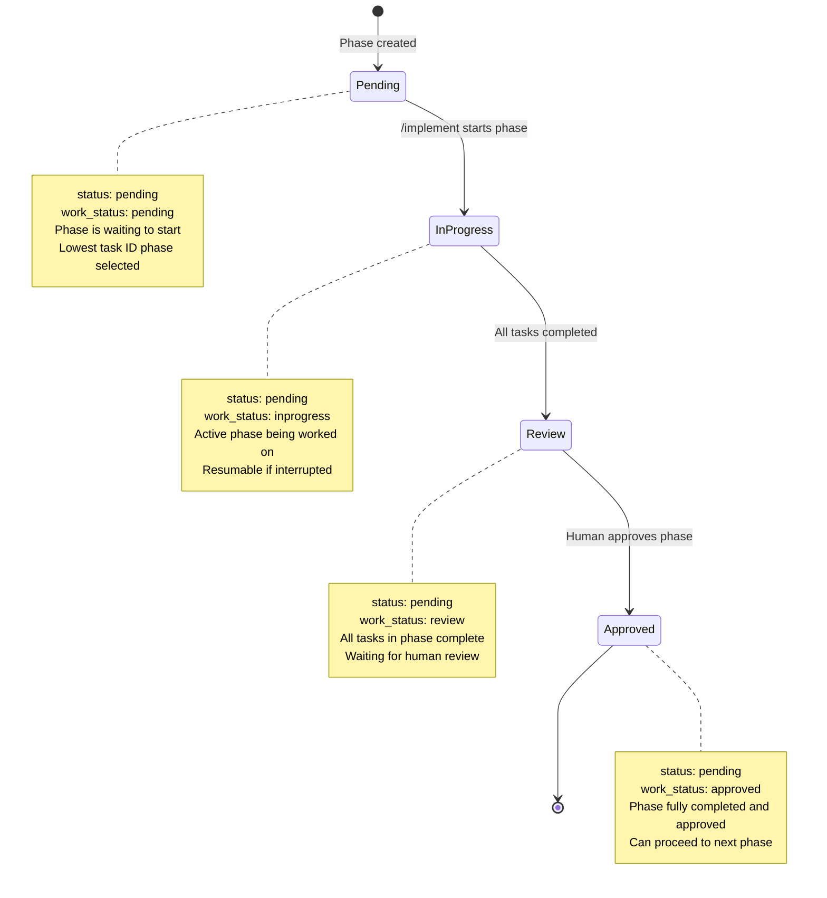
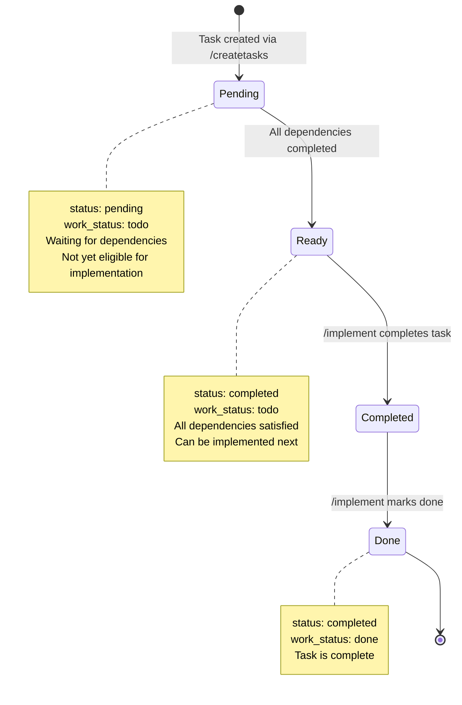
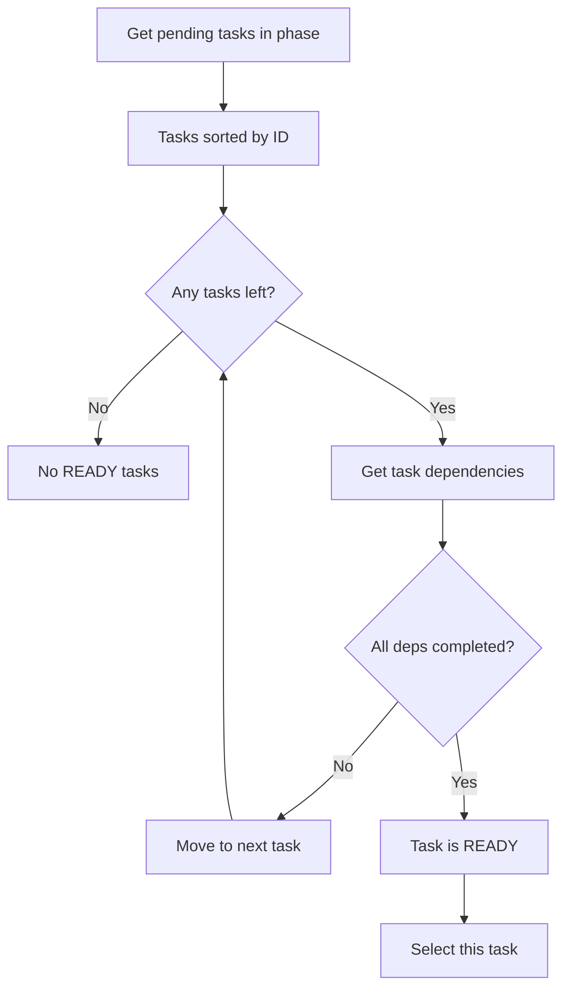
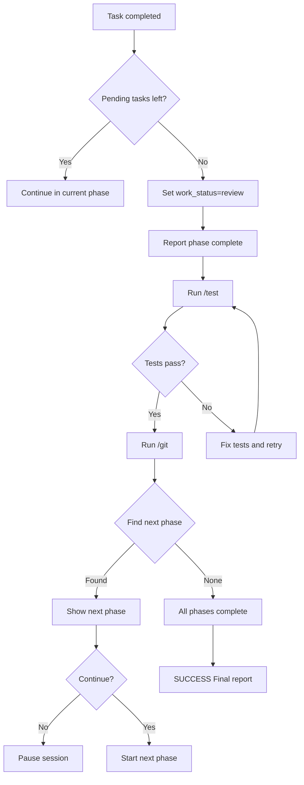
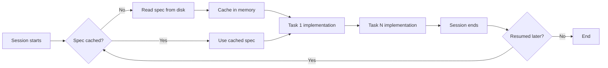

# Implementation Workflows & State Changes

Documentation of workflows and state transitions for the `/implement` command.

## Understanding the Dual Status System

This workflow uses two separate status tracking systems:

### 1. Taskwarrior Status (`status`)
- **Native Taskwarrior field**
- Controls whether tasks are actionable/visible in active lists
- Values: `pending`, `completed`, `deleted`
- Implementation tasks are marked `status:completed` when done
- **Purpose**: Taskwarrior lifecycle management

### 2. Custom Work Status (`work_status`)
- **Custom annotation field** added to tasks
- Tracks workflow-specific progress
- Values vary by entity (spec, phase, task)
- **Purpose**: Implementation workflow tracking

### Why Two Systems?

Taskwarrior's `status` is too coarse-grained for our workflow. We need:
- Distinguish "pending" from "ready to implement"
- Track phases as "in progress" vs "in review"
- Maintain approval states for specs and phases

The custom `work_status` provides this granularity without breaking Taskwarrior's native behavior.

**Example**: A completed implementation task has `status:completed` (taskwarrior lifecycle) AND `work_status:done` (workflow tracking).

## 1. Overall Implementation Workflow



## 2. Phase State Transitions



## 3. Implementation Task State Transitions



## 4. Task Selection Logic (READY Task Detection)



## 5. Phase Completion & Transition Flow



## 6. Spec Caching & Resumption Flow



## State Field Reference

### Taskwarrior Status (Native Field)
Taskwarrior's built-in `status` field tracks task lifecycle. Only `pending` tasks are actionable.

| Value | Meaning | When Set |
|-------|---------|---------|
| `pending` | Task is waiting to be worked on | Default when created |
| `completed` | Task is finished | Set by `task done` command |
| `deleted` | Task was deleted | Set by `task delete` command |

### Custom Work Status (Annotation Field)
Custom `work_status` annotation tracks workflow-specific progress.

| Entity | Field | Values | Purpose |
|--------|-------|--------|---------|
| Spec | `work_status` | `approved` | Must be approved before implementation |
| Phase | `work_status` | `pending`, `inprogress`, `review`, `approved` | Tracks phase lifecycle through implementation workflow |
| Phase | `status` (taskwarrior) | `pending` | Phases remain pending throughout lifecycle |
| Task | `work_status` | `todo`, `done` | Implementation progress tracking |

### Key Differences

| Aspect | taskwarrior `status` | `work_status` |
|--------|---------------------|---------------|
| **Type** | Native field | Custom annotation |
| **Scope** | All Taskwarrior tasks | Implementation workflow only |
| **Lifecycle** | pending → completed/deleted | todo → done (tasks)<br/>pending → inprogress → review → approved (phases) |
| **Primary Use** | Filter actionable tasks | Track workflow progress |

## Key Workflow Rules

1. **Spec must be approved** (`work_status:approved`) before any implementation
2. **Phases are sequential** - complete one before starting next
3. **Tasks within phase** follow dependency order
4. **Only READY tasks** (all deps completed, taskwarrior `status:pending`) can be implemented
5. **Phase auto-transitions** `work_status:review` when all tasks complete
6. **Tests run at phase completion** - `/test` and `/git` only after all tasks in phase are done
7. **Resumption** happens by checking for phase `work_status:inprogress` first
8. **Human approval required** at phase boundaries and task completion
9. **Taskwarrior `status`** controls whether task is actionable (only `pending` tasks appear in active lists)
10. **Custom `work_status`** tracks workflow progress independently of taskwarrior status

## Testing & Commit Flow

Testing and git operations occur at **phase boundaries**, not after each individual task:

```
Task 1 → Task 2 → Task N → Phase Complete → /test → /git → Next Phase
```

**Rationale:**
- Batch testing reduces overhead
- Commit logical groups of related changes
- Easier to revert if needed
- Aligns with phase-based workflow

## Related Documentation

- `/command/implement.md` - Full implementation command specification
- `/command/specjira.md` - Spec creation workflow
- `/command/createtasks.md` - Task generation from spec
